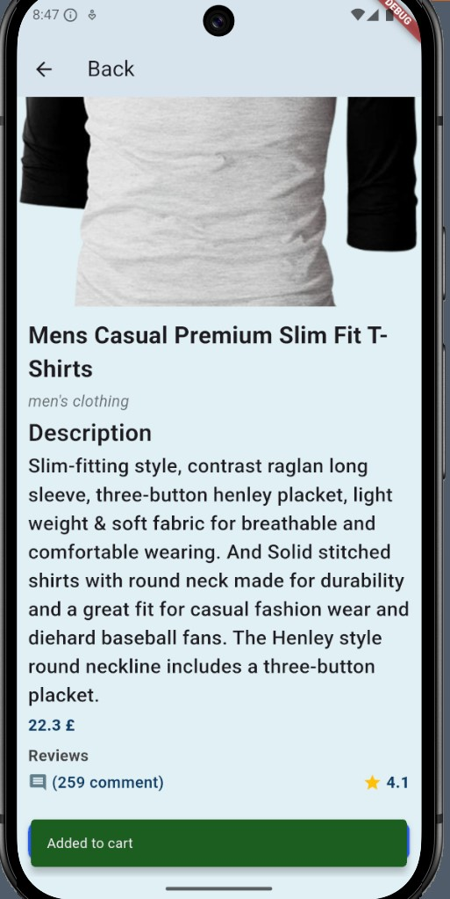
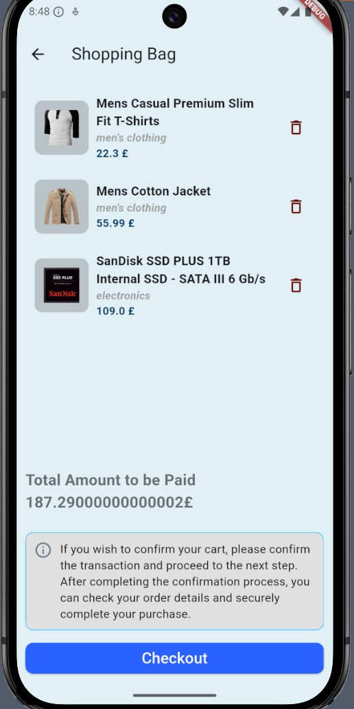
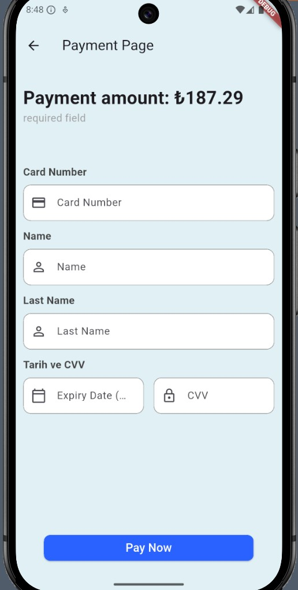
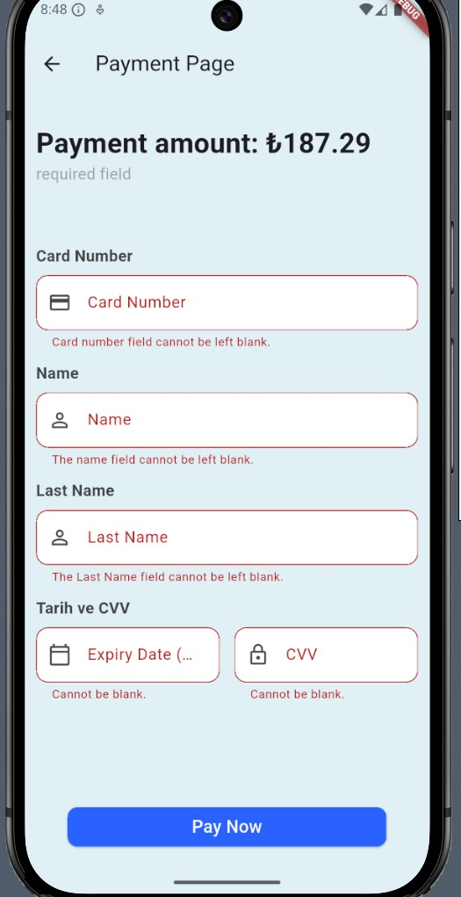

# Storied Store - Flutter E-Commerce Application

Hüseyin Adıgüzel önderliğinde yürütülen staj programı kapsamında geliştirilmiş, REST API entegrasyonuna sahip, dinamik ve kullanıcı dostu bir e-ticaret mobil uygulaması projesidir.

---

## Proje Hakkında
Bu uygulama, **FakeStoreAPI** servislerini asenkron olarak tüketerek dinamik ürün listeleme, detay görüntüleme ve state tabanlı sepet yönetimi sunan modern bir e-ticaret arayüzüdür. Projede görsel hiyerarşi, bileşen tabanlı (component) mimari ve modern null-safety kuralları titizlikle uygulanmıştır.

---

## Kullanılan Teknolojiler ve Sürümler
* **Flutter Sürümü:** `v3.44.1` (Stable Channel)
* **Dart Sürümü:** `v3.12.1`

---

## Uygulama Çalışma Adımları ve Geliştirme Süreci

Uygulamanın geliştirme süreci ve ekranların çalışma mantığı mantıksal bir sıra ile aşağıda özetlenmiştir:

### 1. Home Screen (Ana Sayfa) Tasarımı ve Veri Akışı
* **Görsel Düzen ve Grid Yapısı:** Ana sayfada dengeli bir görsel hiyerarşi oluşturulabilmesi için başlıkların font boyutları ve ağırlıkları titizlikle ayarlanmıştır. Ürünlerin listelenmesi için `GridView.builder` kullanılarak `crossAxisCount: 2` düzeninde çift sütunlu bir matris yapısı kurulmuştur.
* **Bileşen (Component) Mimarisi:** Kodun tekrar kullanılabilirliğini artırmak amacıyla her bir ürün kartı `ProductItemTile` ismiyle bağımsız bir bileşen haline getirilmiştir. Kartların yükseklikleri, kenarlık ve soft gölge ayarları e-ticaret standartlarına uygun olarak optimize edilmiştir.
* **Asenkron Veri Yönetimi (`initState`):** Sayfa henüz yüklenmeden önce `initState` metodu tetiklenerek `ApiServices.fetchProducts()` fonksiyonu üzerinden API çağrısı asenkron olarak başlatılır. Veri çekme esnasında `loading = true` durumu ile ekranda bir `CircularProgressIndicator` gösterilir; işlem başarıyla tamamlandığında gelen veriler `allProducts` listesine aktarılarak arayüz güncellenir.
* **Arama ve Banner Yapısı:** `TextField` widget'ı kullanılarak özelleştirilmiş bir arama barı yerleştirilmiş ve `ClipRRect` ile sarmalanarak köşeleri yumuşatılmış dinamik bir reklam banner alanı entegre edilmiştir.

### **Ana Sayfa:**
> 

### 2. Sayfalar Arası Geçiş ve Constructor Veri Aktarımı
* **Navigasyon Mantığı:** Ana sayfadaki herhangi bir ürün kartına tıklandığında `GestureDetector` widget'ı bu tetiklemeyi yakalar ve `Navigator.push` / `MaterialPageRoute` kullanılarak kullanıcı **ProductDetailScreen (Ürün Detay Sayfası)** ekranına yönlendirilir.
* **Veri Taşıma:** Geçiş esnasında tıklanan ürüne ait nesne (`Product product`) ve sepet durumunu kontrol eden küme (`Set<int> cartIds`), detay sayfasının **constructor** (kurucu metot) yapısı üzerinden güvenli ve kayıpsız bir şekilde alt ekrana taşınır.

### 3. Product Detail Screen (Ürün Detay Sayfası) Mantığı
* **Hero Animasyonu:** Ana sayfadan detay sayfasına geçiş esnasında kullanıcılara kusursuz bir görsel deneyim sunmak adına ürün resimleri `Hero` widget'ı ile sarmalanmıştır. Benzersiz bir eşleşme sağlaması için `tag` bilgisi olarak doğrudan `widget.product.id` kullanılmıştır.
* **Veri Gösterimi ve Esneklik:** Taşınan nesne üzerinden ürünün başlığı, kategorisi, açıklaması, fiyatı, yorum sayısı (Reviews) ve puanı null-safety kontrollerinden geçirilerek ekrana basılmıştır. `SingleChildScrollView` ve `SafeArea` sarmalları sayesinde ekran taşma (`overflow`) hataları engellenmiştir.

### **Detay Sayfası:**
> &nbsp;&nbsp;&nbsp;&nbsp;

### 4. Set Tabanlı Dinamik Sepet Yönetimi (Cart Screen)
* **Benzersiz Sepet Yapısı (`Set`):** Tekrarlayan ürün kayıtlarını önlemek ve verimliliği artırmak için `List` yerine benzersiz ID tutan `Set<int> cartIds` yapısı tercih edilmiştir.
* **Durum Güncelleme & Bildirim:** Detay sayfasında "Buy Now" butonuna basıldığında `setState` ile ürün ID'si sekmeye eklenir ve anlık olarak şık bir `SnackBar` ("Added to cart") gösterilir.
* **Listeleme ve Dinamik Silme:** Sepetteki ürünler ana ekrandan gelen ID'lere göre filtrelenip `CartItemTile` ile listelenir. Ürün çıkarılırken `OnRemove` (VoidCallback) tetiklenerek kümeden anlık düşürülür.
* **Anlık Tutar Hesaplama:** Ürün fiyatları `.fold()` fonksiyonu kullanılarak dinamik olarak toplanır ve sepet güncellendikçe toplam tutar anlık update edilir.
* **Sepet Kontrolü & Navigasyon:** "Checkout" butonuna basıldığında sepet boş ise `SnackBar` uyarısıyla birlikte `Navigator.pop` yapılarak ana ekrana dönülür; dolu ise ödeme sayfasına geçilir.

### **Sepet Sayfası:**

>       

### 5. Güvenli Ödeme Aşaması (Payment Page)
* **Form Doğrulaması:** Ödeme sayfasındaki tüm girdi alanları (`TextFormField`) bir `Form` ve `GlobalKey<FormState>` yapısı altında toplanmıştır. "Pay Now" butonuna basıldığında alanların boş geçilip geçilmediği validasyon kontrolünden geçirilir; böylece alanların boş geçilmesi engellenir.
* **Veri Güvenliği ve Maskeleme:** Kullanıcı deneyimini artırmak için ilgili alanlara özel klavye tipleri (Numeric/Datetime) atanmış, kart güvenliği için ise sadece CVV alanı `obscureText: true` yapılarak gizlenmiştir.
* **İşlem Sonucu:** Validasyon başarılı olduğunda kullanıcıya yeşil renkli, havada asılı (`floating`) bir `SnackBar` ile ödemenin işleme alındığı bilgisi ("Processing Payment...") gösterilir.

### **Ödeme Sayfası:**
>     
